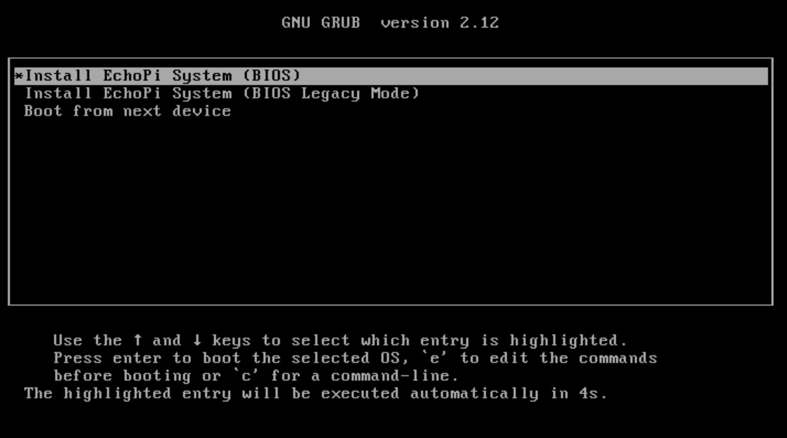
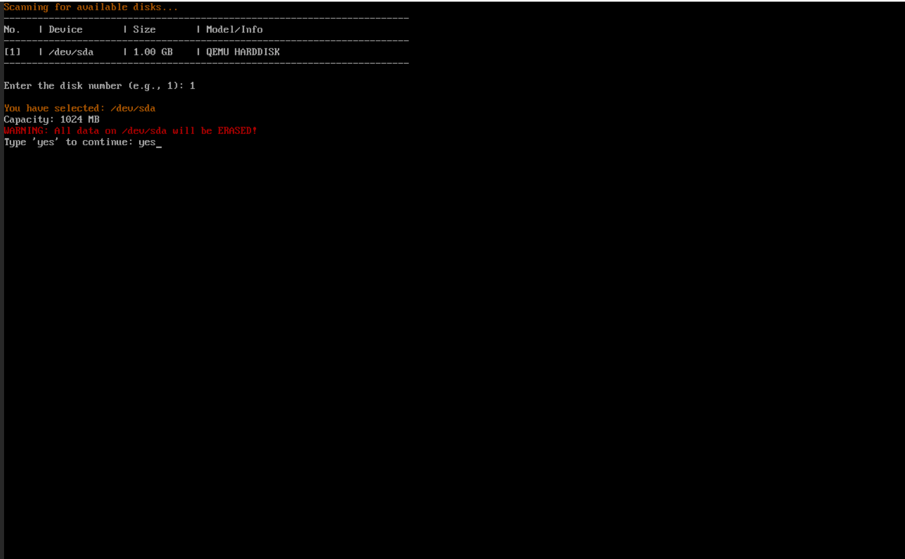
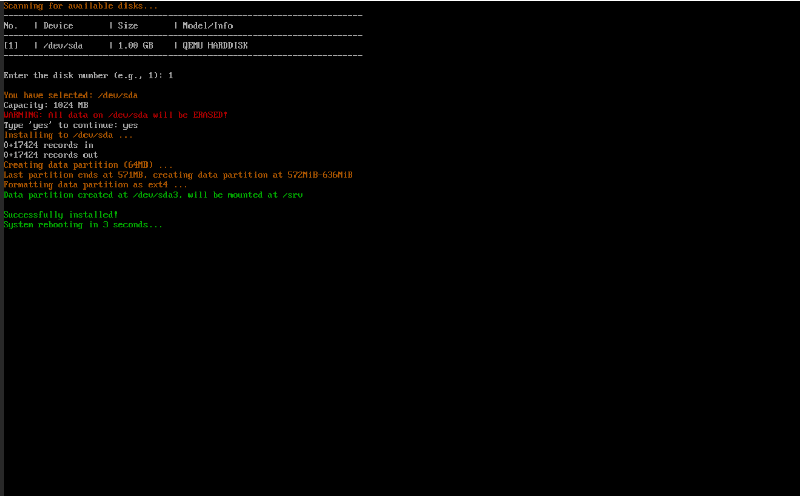
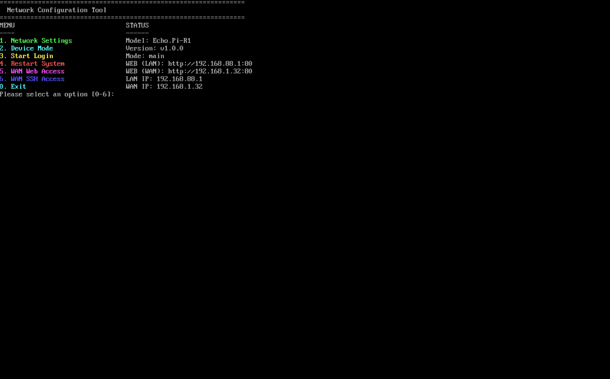

# Echo.Pi Gateway Firmware v1.0.0

## Downloads

| File | Description |
|------|-------------|
| `Echo.Pi-Legacy-*.iso` | Legacy BIOS mode (older devices) |
| `Echo.Pi-UEFI-*.iso` | UEFI mode (modern devices) |

---

## Installation Guide

### Step 1: Create Bootable USB

Download the ISO file and write it to a USB drive using:

- **Ventoy** (Recommended):
  - Download: https://www.ventoy.net/en/download.html
  - Guide: https://www.ventoy.net/en/doc_start.html
  - Install Ventoy once, then simply copy ISO files to the USB drive

- **Windows**: Rufus or balenaEtcher
- **Mac/Linux**: balenaEtcher or `dd` command

### Step 2: Boot from USB

Insert the USB drive into your device and boot from it. Change boot order in BIOS/UEFI if needed.

### Step 3: Install Firmware

Follow the on-screen prompts to complete installation. Choose your target disk and confirm.

### Installation Complete

After installation finishes, remove the USB drive and reboot. The device will start with Echo.Pi firmware.

---

## Next Steps

1. Access Web UI: `http://192.168.88.1` (default)
2. Login with default credentials
3. Configure WAN/LAN settings
4. Set up additional features (VPN, VLAN, etc.)

---

## Support

- **Documentation**: [README.md](README.md) | [简体中文](README_zh.md)
- **Issues**: https://github.com/gamilwcy/openwrt-echopi-firmware/issues

---

 

---

## 中文版本

[查看中文发布说明](#echo-pi-网关固件-v100)

---

# Echo.Pi 网关固件 v1.0.0

## 下载链接

| 文件 | 说明 |
|------|------|
| `Echo.Pi-Legacy-*.iso` | Legacy BIOS 模式（老旧设备） |
| `Echo.Pi-UEFI-*.iso` | UEFI 模式（现代设备） |

---

## 安装指南

### 步骤 1：制作启动盘

下载 ISO 文件并写入 U 盘：

- **Ventoy**（推荐）:
  - 下载：https://www.ventoy.net/en/download.html
  - 教程：https://www.ventoy.net/en/doc_start.html
  - 只需安装一次 Ventoy，之后直接复制 ISO 文件到 U 盘即可

- **Windows**: 使用 Rufus 或 balenaEtcher
- **Mac/Linux**: 使用 balenaEtcher 或 `dd` 命令

### 步骤 2：从 U 盘启动

将 U 盘插入设备并从 U 盘启动。如需要，在 BIOS/UEFI 中更改启动顺序。

### 步骤 3：安装固件

按照屏幕提示完成安装。选择目标磁盘并确认。

### 安装完成

安装完成后，拔出 U 盘并重启。设备将以 Echo.Pi 固件启动。

---

## 后续步骤

1. 访问 Web 管理界面：`http://192.168.88.1`（默认）
2. 使用默认凭据登录
3. 配置 WAN/LAN 设置
4. 设置其他功能（VPN、VLAN 等）

---

## 技术支持

- **文档**: [README.md](README.md) | [简体中文](README_zh.md)
- **问题反馈**: https://github.com/gamilwcy/openwrt-echopi-firmware/issues
